<div align="center">

<picture>
  <source media="(prefers-color-scheme: dark)" srcset="assets/hero-dark.svg">
  
</picture>

</div>

<div align="center">

<picture>
  <source media="(prefers-color-scheme: dark)" srcset="assets/registry-dark.svg">
  
</picture>

</div>

<div align="center">

### Building AI systems that assume the model can be wrong.

Seventeen experiments. Every one of them is the same question in a different domain.

[**Portfolio &mdash; a live retrieval assistant you can interrogate &rarr;**](https://project-tayab.onrender.com/)

</div>

<picture>
  <source media="(prefers-color-scheme: dark)" srcset="assets/divider-dark.svg">
  
</picture>

## The lab

Five divisions. Grouped by the question the work asks, not the language it happens to be written in.

<picture>
  <source media="(prefers-color-scheme: dark)" srcset="assets/lab-map-dark.svg">
  
</picture>

<picture>
  <source media="(prefers-color-scheme: dark)" srcset="assets/divider-dark.svg">
  
</picture>

## What I am solving

Every card is a real repository. Open the notebook under it for the objective, the failure it guards against, the architecture and the stack.

### Division 01 &nbsp;&middot;&nbsp; Autonomous Agents

> Can a system diagnose a fault and act on it without a human in the loop?

<picture>
  <source media="(prefers-color-scheme: dark)" srcset="assets/cards/card-FaultSeeker--dark.svg">
  
</picture>

[**FaultSeeker &rarr;**](https://github.com/Tayab-Ahamed/FaultSeeker-)

<details>
<summary><b>Open the notebook</b> &mdash; EXP-01 FaultSeeker</summary>

**Objective.** Locate the vulnerability behind an on-chain exploit by replaying the transaction that caused it.

**The problem.** After a smart contract is drained, the evidence is a raw trace. Reading it by hand is slow, and a wrong conclusion is worse than none.

**Architecture.** Trace ingestion across EVM chains, a reentrancy detection engine, and a confidence calibrator that reports how much the verdict should be trusted.

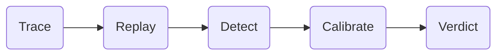

| | |
|---|---|
| **Stack** | Python &middot; EVM traces &middot; Ollama &middot; OpenAI &middot; Gemini &middot; Claude &middot; Qwen &middot; LaTeX |
| **Language** | Python |
| **Licence** | Apache-2.0 |
| **Created** | 13 March 2026 |
| **Repository** | [FaultSeeker-](https://github.com/Tayab-Ahamed/FaultSeeker-) |
| **Status** | Open source, no public deployment |

> Carries a LaTeX survey paper alongside the code. The only repo of the seventeen with an outside fork.

</details>

<picture>
  <source media="(prefers-color-scheme: dark)" srcset="assets/cards/card-RepoMedic-Agent-dark.svg">
  
</picture>

[**RepoMedic-Agent &rarr;**](https://github.com/Tayab-Ahamed/RepoMedic-Agent)

<details>
<summary><b>Open the notebook</b> &mdash; EXP-05 RepoMedic-Agent</summary>

**Objective.** Audit any GitHub repository or local codebase and return one health report.

**The problem.** Code review catches the diff. Nobody reviews the repository itself -- its secrets, its missing tests, its stale dependencies.

**Architecture.** Six skills run in sequence -- repo analysis, security scan, doc analysis, test analysis, dependency analysis, scoring -- producing a weighted score, ranked issues and quick wins as structured JSON.

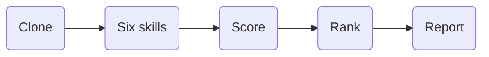

| | |
|---|---|
| **Stack** | Node.js 18+ &middot; gitagent &middot; GitHub API &middot; npm registry |
| **Language** | JavaScript |
| **Licence** | MIT |
| **Created** | 3 April 2026 |
| **Topics** | `ai-agent` &middot; `code-quality` &middot; `dev-tools` &middot; `gitagent` &middot; `gitclaw` &middot; `hackathon` &middot; `nodejs` &middot; `security` |
| **Repository** | [RepoMedic-Agent](https://github.com/Tayab-Ahamed/RepoMedic-Agent) |
| **Status** | Open source, no public deployment |

> Audits itself in CI. Secrets are masked in every finding.

</details>

<picture>
  <source media="(prefers-color-scheme: dark)" srcset="assets/cards/card-neuroops-dark.svg">
  
</picture>

[**neuroops &rarr;**](https://github.com/Tayab-Ahamed/neuroops)

<details>
<summary><b>Open the notebook</b> &mdash; EXP-10 neuroops</summary>

**Objective.** Detect a cluster incident, find the root cause, and remediate it without paging a human.

**The problem.** On-call exists because the diagnosis step is human. An agent that guesses the cause and acts on it is more dangerous than the outage.

**Architecture.** A LangGraph multi-agent root-cause pipeline over Kubernetes, instrumented with OpenTelemetry so the agent's own reasoning is observable, and benchmarked against deliberately injected chaos experiments.

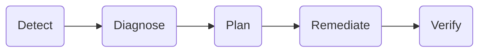

| | |
|---|---|
| **Stack** | Python &middot; LangGraph &middot; Kubernetes &middot; OpenTelemetry &middot; Chaos engineering |
| **Language** | Python |
| **Licence** | MIT |
| **Created** | 22 May 2026 |
| **Repository** | [neuroops](https://github.com/Tayab-Ahamed/neuroops) |
| **Status** | Open source, no public deployment |

> Self-observability is the point -- the agent is measured the way it measures the cluster.

</details>

<picture>
  <source media="(prefers-color-scheme: dark)" srcset="assets/cards/card-Airgap-noc-Copilot-dark.svg">
  
</picture>

[**Airgap NOC Copilot &rarr;**](https://github.com/Tayab-Ahamed/Airgap-noc-Copilot)

<details>
<summary><b>Open the notebook</b> &mdash; EXP-16 Airgap NOC Copilot</summary>

**Objective.** Predict MPLS and SD-WAN fault precursors before they become an outage, and hand the operator a runbook, on a network with no internet connection.

**The problem.** Every network copilot assumes a cloud API. Carrier, defence and industrial networks are air-gapped, so a tool that phones home cannot be installed at all &mdash; and a tool that guesses at three in the morning is worse than no tool.

**Architecture.** Telemetry from a Containerlab and FRRouting testbed feeds a machine learning risk scorer that ranks fault precursors. The highest-risk incident is enriched by local FAISS retrieval over the runbook corpus, and a locally hosted LLM writes the root cause analysis. Nothing leaves the box.

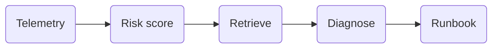

| | |
|---|---|
| **Stack** | Python &middot; Machine learning risk scoring &middot; FAISS &middot; Local LLM &middot; RAG &middot; Containerlab &middot; FRRouting |
| **Language** | Python |
| **Licence** | None declared |
| **Created** | 13 August 2026 |
| **Topics** | ai-copilot &middot; air-gapped &middot; predictive-maintenance &middot; rag &middot; sd-wan &middot; network-operations |
| **Repository** | [Airgap-noc-Copilot](https://github.com/Tayab-Ahamed/Airgap-noc-Copilot) |
| **Status** | Prototype, no public deployment |

> The constraint is the design: if it cannot run offline, it cannot run here.

</details>

<picture>
  <source media="(prefers-color-scheme: dark)" srcset="assets/cards/card-RecoverOS-dark.svg">
  
</picture>

[**RecoverOS &rarr;**](https://github.com/Tayab-Ahamed/RecoverOS)

<details>
<summary><b>Open the notebook</b> &mdash; EXP-17 RecoverOS</summary>

**Objective.** Recover revenue lost to failed payments, checkout drop-offs, lapsed subscriptions and overdue receivables, without letting an agent act on money unsupervised.

**The problem.** Dunning is usually a cron job with three email templates, and the agentic version of it is worse: an autonomous system near a payment rail needs a bound it cannot cross and a record a finance team can audit.

**Architecture.** A detector raises the recovery event. An adaptive agent decides the next action. A policy layer bounds what that action is allowed to be, execution is checked against verified payment proof, and every decision, attempt and outcome is written to a complete audit trail.

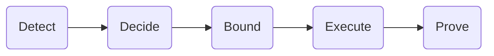

| | |
|---|---|
| **Stack** | Python &middot; Agent decision loop &middot; Policy engine &middot; Bounded execution &middot; Payment verification &middot; Audit trail |
| **Language** | Python |
| **Licence** | MIT |
| **Created** | 22 August 2026 |
| **Repository** | [RecoverOS](https://github.com/Tayab-Ahamed/RecoverOS) |
| **Status** | Open source, no public deployment |

> An agent allowed near money is only as good as the bound it cannot cross.

</details>

<picture>
  <source media="(prefers-color-scheme: dark)" srcset="assets/divider-dark.svg">
  
</picture>

### Division 02 &nbsp;&middot;&nbsp; Grounded Retrieval

> Can a model answer only from evidence it is able to cite?

<picture>
  <source media="(prefers-color-scheme: dark)" srcset="assets/cards/card-StudyMind-dark.svg">
  
</picture>

[**StudyMind &rarr;**](https://github.com/Tayab-Ahamed/StudyMind)

<details>
<summary><b>Open the notebook</b> &mdash; EXP-02 StudyMind</summary>

**Objective.** Upload PDFs, get summaries, and hold a conversation with your own notes.

**The problem.** A general chatbot will answer confidently about a document it has never read.

**Architecture.** React client, Node service, MongoDB store, JWT auth, Claude for summarisation and chat.

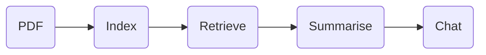

| | |
|---|---|
| **Stack** | React &middot; Node.js &middot; MongoDB &middot; JWT &middot; Claude |
| **Language** | JavaScript |
| **Licence** | none declared |
| **Created** | March 2026 |
| **Repository** | [StudyMind](https://github.com/Tayab-Ahamed/StudyMind) |
| **Status** | Prototype, no public deployment |

> The earliest retrieval experiment. Everything in Division 02 is a stricter answer to the same question.

</details>

<picture>
  <source media="(prefers-color-scheme: dark)" srcset="assets/cards/card-AI-Sakhi-dark.svg">
  
</picture>

[**AI-Sakhi &rarr;**](https://github.com/Tayab-Ahamed/AI-Sakhi)

<details>
<summary><b>Open the notebook</b> &mdash; EXP-09 AI-Sakhi</summary>

**Objective.** Teach, then measure whether the teaching worked, then adapt -- with every claim traceable to a source page.

**The problem.** A tutor that hallucinates does not merely fail to teach. It installs a misconception that has to be removed later.

**Architecture.** Next.js 16 standalone and FastAPI. Retrieval uses all-MiniLM-L6-v2 embeddings in ChromaDB with page-level attribution and a distance threshold that refuses to answer rather than guess. SM-2 spaced repetition schedules review; a mastery score combines accuracy, difficulty, recency and hint penalty; a deterministic, auditable classifier labels misconceptions. JWT, role-based access and tenant isolation across student, teacher, guardian and admin roles.

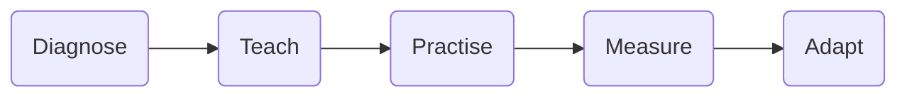

| | |
|---|---|
| **Stack** | Next.js 16 &middot; FastAPI &middot; Python 3.11 &middot; Groq &middot; Llama &middot; ChromaDB &middot; all-MiniLM-L6-v2 &middot; SQLite WAL &middot; JWT &middot; Docker |
| **Language** | TypeScript |
| **Licence** | none declared |
| **Created** | 12 May 2026 |
| **Repository** | [AI-Sakhi](https://github.com/Tayab-Ahamed/AI-Sakhi) |
| **Status** | Prototype, no public deployment |

> The retrieval threshold is a refusal mechanism: below it, the system declines to answer.

</details>

<picture>
  <source media="(prefers-color-scheme: dark)" srcset="assets/cards/card-vetaid-rag-assistant-dark.svg">
  
</picture>

[**VetAid &rarr;**](https://github.com/Tayab-Ahamed/vetaid-rag-assistant)

<details>
<summary><b>Open the notebook</b> &mdash; EXP-11 VetAid</summary>

**Objective.** Give a pet owner calm, step-by-step first aid during an emergency, with every step cited.

**The problem.** An owner searching during an emergency gets contradictory advice from strangers. A hallucinated instruction here can kill the animal.

**Architecture.** Streamlit interface over a LangChain and ChromaDB retrieval pipeline into Groq-hosted Llama 3.1. Species-aware filters for dog, cat and other; inline citations with expandable source evidence; conversational memory across follow-ups; indexes both the bundled manuals and user-uploaded PDFs.

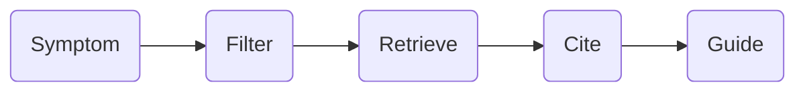

| | |
|---|---|
| **Stack** | Python &middot; Streamlit &middot; LangChain &middot; ChromaDB &middot; Groq &middot; Llama 3.1 |
| **Language** | Python |
| **Licence** | none declared |
| **Created** | 2 July 2026 |
| **Topics** | `ai-assistant` &middot; `chatbot` &middot; `chromadb` &middot; `groq` &middot; `langchain` &middot; `llama3` &middot; `rag` &middot; `semantic-search` &middot; `streamlit` |
| **Repository** | [vetaid-rag-assistant](https://github.com/Tayab-Ahamed/vetaid-rag-assistant) |
| **Status** | Prototype, no public deployment |

> Ships a warning that it is not a substitute for a veterinarian. Knowing the limit is part of the design.

</details>

<picture>
  <source media="(prefers-color-scheme: dark)" srcset="assets/divider-dark.svg">
  
</picture>

### Division 03 &nbsp;&middot;&nbsp; Perception and Vision

> Can a single camera frame become a decision?

<picture>
  <source media="(prefers-color-scheme: dark)" srcset="assets/cards/card-Pothole-Detection-dark.svg">
  
</picture>

[**Pothole-Detection &rarr;**](https://github.com/Tayab-Ahamed/Pothole-Detection)

<details>
<summary><b>Open the notebook</b> &mdash; EXP-03 Pothole-Detection</summary>

**Objective.** Detect potholes in a live camera feed, a video file, or a still image, and log every detection.

**The problem.** Road defect surveys are manual. A detector is only useful if it runs on the hardware a survey team already has.

**Architecture.** YOLOv8 inference behind both a Flask dashboard and a CLI, with webcam, video and image inputs and CSV export.

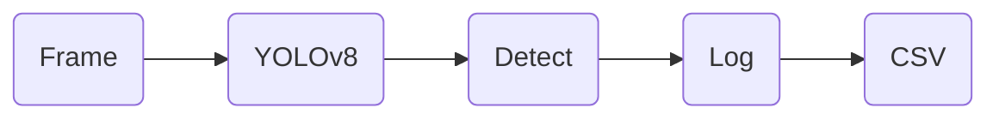

| | |
|---|---|
| **Stack** | Python &middot; YOLOv8 &middot; Flask &middot; OpenCV &middot; CSV export |
| **Language** | Python |
| **Licence** | none declared |
| **Created** | March 2026 |
| **Repository** | [Pothole-Detection](https://github.com/Tayab-Ahamed/Pothole-Detection) |
| **Status** | Prototype, no public deployment |

> First perception experiment. Two interfaces over one model -- a pattern that repeats later.

</details>

<picture>
  <source media="(prefers-color-scheme: dark)" srcset="assets/cards/card-ecosentinel-dark.svg">
  
</picture>

[**ecosentinel &rarr;**](https://github.com/Tayab-Ahamed/ecosentinel)

<details>
<summary><b>Open the notebook</b> &mdash; EXP-07 ecosentinel</summary>

**Objective.** Watch air quality and wildfire risk on one map, and forecast where the readings are heading.

**The problem.** Environmental data arrives from separate feeds at separate cadences, and none of them tell you what happens next.

**Architecture.** Next.js 16 and React 19 front end with Three.js, Leaflet and Recharts; FastAPI backend on SQLModel and Alembic over PostgreSQL; Gemini Vision for imagery, Prophet for PM2.5, CO2 and NO2 forecasting, Whisper for speech input, NASA FIRMS for wildfire coordinates.

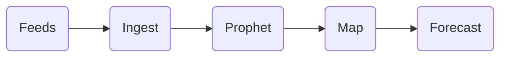

| | |
|---|---|
| **Stack** | Next.js 16 &middot; React 19 &middot; Tailwind v4 &middot; Three.js &middot; Leaflet &middot; FastAPI &middot; SQLModel &middot; Alembic &middot; PostgreSQL &middot; Gemini Vision &middot; Prophet &middot; Whisper &middot; NASA FIRMS |
| **Language** | TypeScript |
| **Licence** | MIT |
| **Created** | 19 April 2026 |
| **Topics** | `air-quality` &middot; `climate` &middot; `computer-vision` &middot; `docker` &middot; `environmental-monitoring` &middot; `fastapi` &middot; `full-stack` &middot; `machine-learning` &middot; `nextjs` &middot; `react` &middot; `typescript` &middot; `wildfire-detection` |
| **Repository** | [ecosentinel](https://github.com/Tayab-Ahamed/ecosentinel) |
| **Status** | Open source, no public deployment |

> Ships its own design system rather than a component library.

</details>

<picture>
  <source media="(prefers-color-scheme: dark)" srcset="assets/cards/card-ReloopAI-dark.svg">
  
</picture>

[**ReloopAI &rarr;**](https://github.com/Tayab-Ahamed/ReloopAI)

<details>
<summary><b>Open the notebook</b> &mdash; EXP-15 ReloopAI</summary>

**Objective.** Turn one photo of surplus into a matched, routed, tracked and impact-reported pickup.

**The problem.** Surplus is redistributed by phone calls and spreadsheets, so it expires before it reaches anyone.

**Architecture.** Vision, OCR and an LLM run in parallel on the uploaded photo to draft the listing. A weighted scorer ranks recipients on distance 30, urgency 25, category fit 20, storage 15 and availability 10. Three n8n workflows then orchestrate approval, dispatch and the post-pickup impact receipt. The AI layer is provider-agnostic and boots with no keys at all on a mock provider.

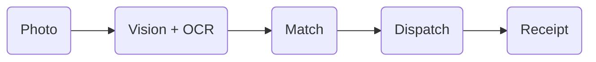

| | |
|---|---|
| **Stack** | React 18 &middot; TypeScript 5.6 &middot; Vite 6 &middot; Three.js r169 &middot; Framer Motion &middot; Node 20 &middot; Express &middot; MongoDB &middot; Groq &middot; Llama 3.2 Vision &middot; n8n &middot; SendGrid &middot; Twilio &middot; S3 |
| **Language** | TypeScript |
| **Licence** | MIT |
| **Created** | 13 July 2026 |
| **Repository** | [ReloopAI](https://github.com/Tayab-Ahamed/ReloopAI) |
| **Status** | **Live** &mdash; deployed and reachable |
| **Live** | [reloop-ai-liart.vercel.app](https://reloop-ai-liart.vercel.app) |

> The only experiment with a public deployment, and the most committed-to of the seventeen.

</details>

<picture>
  <source media="(prefers-color-scheme: dark)" srcset="assets/divider-dark.svg">
  
</picture>

### Division 04 &nbsp;&middot;&nbsp; Systems and Simulation

> Can we test the consequence before it reaches the world?

<picture>
  <source media="(prefers-color-scheme: dark)" srcset="assets/cards/card-Deploy-Platform-dark.svg">
  
</picture>

[**Deploy-Platform &rarr;**](https://github.com/Tayab-Ahamed/Deploy-Platform)

<details>
<summary><b>Open the notebook</b> &mdash; EXP-04 Deploy-Platform</summary>

**Objective.** Give a single machine the deploy-a-container-and-get-a-URL workflow of a hosted PaaS.

**The problem.** Managed platforms are the fastest way to ship and the fastest way to lose control of your own infrastructure.

**Architecture.** Go 1.22 API on the standard library with zero external dependencies, React and Vite dashboard, k3s for scheduling, a local Docker Registry v2, Nginx wildcard routing, and a JSON file as the database.

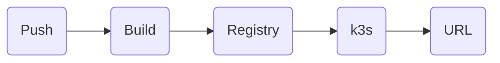

| | |
|---|---|
| **Stack** | Go 1.22 &middot; React 18 &middot; Vite &middot; k3s &middot; Docker Registry v2 &middot; Nginx |
| **Language** | Go |
| **Licence** | MIT |
| **Created** | 30 March 2026 |
| **Topics** | `container-registry` &middot; `deployment` &middot; `devops` &middot; `docker` &middot; `docker-compose` &middot; `golang` &middot; `heroku-alternative` &middot; `k3s` &middot; `kubernetes` &middot; `nginx` &middot; `paas` &middot; `platform-engineering` &middot; `react` &middot; `self-hosted` &middot; `vite` &middot; `wsl2` |
| **Repository** | [Deploy-Platform](https://github.com/Tayab-Ahamed/Deploy-Platform) |
| **Status** | Open source, no public deployment |

> Zero external Go dependencies. The whole API is standard library.

</details>

<picture>
  <source media="(prefers-color-scheme: dark)" srcset="assets/cards/card-LifeSim-AI-dark.svg">
  
</picture>

[**LifeSim-AI &rarr;**](https://github.com/Tayab-Ahamed/LifeSim-AI)

<details>
<summary><b>Open the notebook</b> &mdash; EXP-06 LifeSim-AI</summary>

**Objective.** Play out a sequence of financial life decisions and see the compounded consequence.

**The problem.** Financial advice is abstract until you watch a choice compound against you.

**Architecture.** A deterministic rules engine with clamped effects and hidden traits runs the simulation locally; an optional AI mode narrates it. The rules engine is authoritative either way.

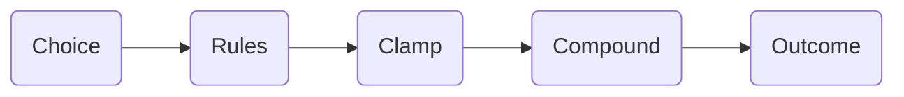

| | |
|---|---|
| **Stack** | TypeScript &middot; React &middot; OpenAI &middot; Gemini &middot; Qwen |
| **Language** | TypeScript |
| **Licence** | none declared |
| **Created** | 9 April 2026 |
| **Repository** | [LifeSim-AI](https://github.com/Tayab-Ahamed/LifeSim-AI) |
| **Status** | Prototype, no public deployment |

> Clearest statement of the fallback pattern -- the model narrates, the rules engine decides.

</details>

<picture>
  <source media="(prefers-color-scheme: dark)" srcset="assets/cards/card-SETRS-Trajectory-Preemption-dark.svg">
  
</picture>

[**SETRS &rarr;**](https://github.com/Tayab-Ahamed/SETRS-Trajectory-Preemption)

<details>
<summary><b>Open the notebook</b> &mdash; EXP-08 SETRS</summary>

**Objective.** Hold a green corridor ahead of a moving ambulance by predicting its trajectory and preempting the signals on its path.

**The problem.** An ambulance loses minutes at intersections it was always going to reach. The signals only react once it arrives.

**Architecture.** SUMO traffic simulation driven through TraCI, a FastAPI control service, and a React operations view -- the corridor is proven in simulation before any real intersection is touched.

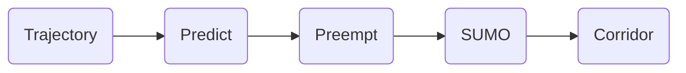

| | |
|---|---|
| **Stack** | Python &middot; SUMO &middot; TraCI &middot; FastAPI &middot; React |
| **Language** | Python |
| **Licence** | none declared |
| **Created** | 26 April 2026 |
| **Topics** | `ambulance-routing` &middot; `emergency-response` &middot; `fastapi` &middot; `intelligent-transportation-systems` &middot; `react` &middot; `smart-city` &middot; `sumo-simulation` &middot; `traci` &middot; `traffic-signal-preemption` |
| **Repository** | [SETRS-Trajectory-Preemption](https://github.com/Tayab-Ahamed/SETRS-Trajectory-Preemption) |
| **Status** | Prototype, no public deployment |

> The strongest case for simulating first -- the failure mode here is measured in lives.

</details>

<picture>
  <source media="(prefers-color-scheme: dark)" srcset="assets/divider-dark.svg">
  
</picture>

### Division 05 &nbsp;&middot;&nbsp; Security and Assurance

> Can a pipeline prove it was not tampered with?

<picture>
  <source media="(prefers-color-scheme: dark)" srcset="assets/cards/card-Sentinel-FL-dark.svg">
  
</picture>

[**Sentinel-FL &rarr;**](https://github.com/Tayab-Ahamed/Sentinel-FL)

<details>
<summary><b>Open the notebook</b> &mdash; EXP-12 Sentinel-FL</summary>

**Objective.** Detect a backdoor in a federated model, explain it, repair it, and cryptographically attest that the repair happened.

**The problem.** Federated learning hides the training data by design, which means it also hides the poison. Detection on its own is not a defence: the party consuming the model has no way to check that anything was actually fixed.

**Architecture.** Client updates arriving at the Flower aggregator are screened for the statistical signature of a backdoor. Flagged updates are explained down to the trigger, the poisoned contribution is repaired out of the global model, and the result is signed so a downstream consumer can verify the mitigation independently.

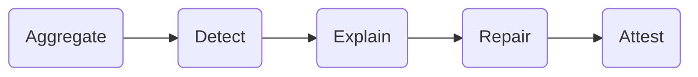

| | |
|---|---|
| **Stack** | Python &middot; Flower &middot; Federated learning &middot; Backdoor defence &middot; Adversarial machine learning &middot; Cryptographic attestation |
| **Language** | Python |
| **Licence** | MIT |
| **Created** | 8 July 2026 |
| **Topics** | ai-security &middot; adversarial-machine-learning &middot; backdoor-defense &middot; federated-learning &middot; flower-framework |
| **Repository** | [Sentinel-FL](https://github.com/Tayab-Ahamed/Sentinel-FL) |
| **Status** | Open source, no public deployment |

> A defence that cannot be verified is a claim, not a defence.

</details>

<picture>
  <source media="(prefers-color-scheme: dark)" srcset="assets/cards/card-Actionguard-Autoaudit-dark.svg">
  
</picture>

[**Actionguard Autoaudit &rarr;**](https://github.com/Tayab-Ahamed/Actionguard-Autoaudit)

<details>
<summary><b>Open the notebook</b> &mdash; EXP-13 Actionguard Autoaudit</summary>

**Objective.** Audit GitHub CI/CD and agentic AI workflows for security flaws, then open the pull request that fixes them.

**The problem.** CI is the softest target in most repositories: unpinned actions, over-scoped tokens, injectable inputs. Scanners find all of it and nobody acts, because a finding that arrives as a report is not a control.

**Architecture.** Workflow definitions are scanned, audited against zizmor and SAST rules, and triaged by severity and exploitability. The remediation engine then generates the patch and raises it as a pull request, so the fix lands in review rather than in a backlog.

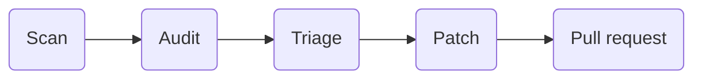

| | |
|---|---|
| **Stack** | Python &middot; GitHub Actions &middot; zizmor &middot; SAST &middot; Agentic remediation |
| **Language** | Python |
| **Licence** | MIT |
| **Created** | 8 July 2026 |
| **Topics** | agentic-ai &middot; ci-cd-security &middot; devsecops &middot; github-actions &middot; sast &middot; security-auditing |
| **Repository** | [Actionguard-Autoaudit](https://github.com/Tayab-Ahamed/Actionguard-Autoaudit) |
| **Status** | Open source, no public deployment |

> A finding that does not arrive as a diff does not get fixed.

</details>

<picture>
  <source media="(prefers-color-scheme: dark)" srcset="assets/cards/card-Actionguard-CI-dark.svg">
  
</picture>

[**Actionguard CI &rarr;**](https://github.com/Tayab-Ahamed/Actionguard-CI)

<details>
<summary><b>Open the notebook</b> &mdash; EXP-14 Actionguard CI</summary>

**Objective.** Score the security of a repository's CI/CD and agentic AI workflows, report it in a form somebody will actually read, and gate the build on the result.

**The problem.** Security output rots inside build artefacts. If the report is not readable and is not allowed to fail the pipeline, the pipeline stays insecure and everyone stays comfortable.

**Architecture.** Workflow definitions are ingested and analysed against action pinning, permission scope and injection rules, the findings are scored, and the run emits interactive HTML and machine-readable JSON. The gate then fails the build when the score falls below the configured threshold.

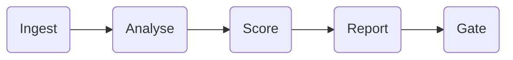

| | |
|---|---|
| **Stack** | Python &middot; GitHub Actions &middot; zizmor &middot; HTML and JSON reporting &middot; CI gating |
| **Language** | Python |
| **Licence** | MIT |
| **Created** | 8 July 2026 |
| **Topics** | agentic-ai &middot; ci-cd-security &middot; devsecops &middot; github-actions &middot; security-auditor &middot; zizmor |
| **Repository** | [Actionguard-CI](https://github.com/Tayab-Ahamed/Actionguard-CI) |
| **Status** | Open source, no public deployment |

> The report is only a control when it is allowed to say no.

</details>

<picture>
  <source media="(prefers-color-scheme: dark)" srcset="assets/divider-dark.svg">
  
</picture>

## How the systems connect

<picture>
  <source media="(prefers-color-scheme: dark)" srcset="assets/atlas-dark.svg">
  
</picture>

These repositories were not planned as an ecosystem. The connections are there anyway, because the same conclusions kept getting reached. Read across a row to see who shares a decision; read down a column to see what a system is made of.

<picture>
  <source media="(prefers-color-scheme: dark)" srcset="assets/substrate-dark.svg">
  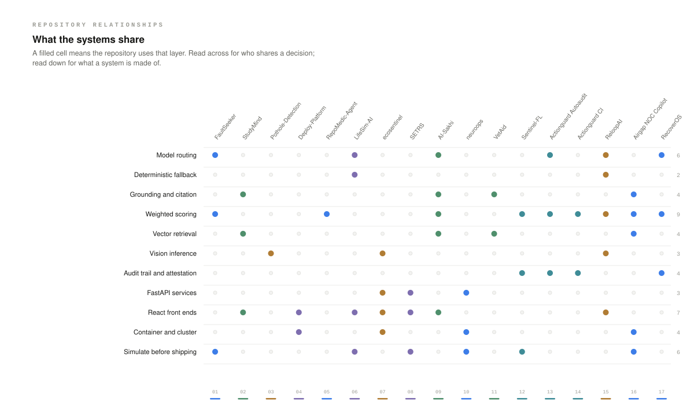
</picture>

<details>
<summary><b>The same graph, as a graph</b></summary>

```mermaid
flowchart TB
    subgraph SHARED ["Shared decisions"]
        ROUTE("Multi-provider routing")
        FALL("Deterministic fallback")
        CITE("Grounding and citation")
        SCORE("Weighted scoring")
        SIM("Simulate before shipping")
        ATTEST("Audit trail and attestation")
    end
    ROUTE --> FaultSeeker & ReloopAI & LifeSim
    FALL --> ReloopAI & LifeSim & AISakhi & FaultSeeker
    CITE --> AISakhi & VetAid & StudyMind & Airgap
    SCORE --> ReloopAI & AISakhi & RepoMedic & Airgap & ActionguardCI
    SIM --> SETRS & neuroops & LifeSim
    ATTEST --> SentinelFL & ActionguardCI & Autoaudit & RecoverOS
    FaultSeeker("FaultSeeker")
    ReloopAI("ReloopAI")
    LifeSim("LifeSim-AI")
    AISakhi("AI-Sakhi")
    VetAid("vetaid-rag-assistant")
    StudyMind("StudyMind")
    RepoMedic("RepoMedic-Agent")
    SETRS("SETRS-Trajectory-Preemption")
    neuroops("neuroops")
    SentinelFL("Sentinel-FL")
    ActionguardCI("Actionguard CI")
    Autoaudit("Actionguard Autoaudit")
    Airgap("Airgap NOC Copilot")
    RecoverOS("RecoverOS")
```

</details>

### Four conclusions I keep reaching

**01 &nbsp; Never depend on one model**

Four repositories put two or more providers behind a single interface. ReloopAI goes furthest: it boots and stays browsable with no API key at all.

<sub>[FaultSeeker](https://github.com/Tayab-Ahamed/FaultSeeker-) &middot; [ReloopAI](https://github.com/Tayab-Ahamed/ReloopAI) &middot; [LifeSim-AI](https://github.com/Tayab-Ahamed/LifeSim-AI) &middot; [AI-Sakhi](https://github.com/Tayab-Ahamed/AI-Sakhi)</sub>

**02 &nbsp; Make the answer show its evidence**

AI-Sakhi attributes to the page and refuses below a distance threshold. VetAid puts citations inline and lets you expand the source. FaultSeeker reports a calibrated confidence with its verdict.

<sub>[AI-Sakhi](https://github.com/Tayab-Ahamed/AI-Sakhi) &middot; [VetAid](https://github.com/Tayab-Ahamed/vetaid-rag-assistant) &middot; [FaultSeeker](https://github.com/Tayab-Ahamed/FaultSeeker-) &middot; [StudyMind](https://github.com/Tayab-Ahamed/StudyMind)</sub>

**03 &nbsp; Simulate before it reaches the world**

SETRS proves an ambulance corridor in SUMO before touching an intersection. neuroops benchmarks its own agent against injected chaos. LifeSim keeps a deterministic engine authoritative over the narration.

<sub>[SETRS](https://github.com/Tayab-Ahamed/SETRS-Trajectory-Preemption) &middot; [neuroops](https://github.com/Tayab-Ahamed/neuroops) &middot; [LifeSim-AI](https://github.com/Tayab-Ahamed/LifeSim-AI)</sub>

**04 &nbsp; Prove it, or it did not happen**

The newest division exists because the other three kept running into the same wall. Sentinel-FL signs the repair so the fix can be verified by whoever consumes the model. Actionguard CI is allowed to fail the build. Actionguard Autoaudit delivers its findings as a pull request rather than a report. RecoverOS will not touch money outside a policy bound, and writes what it did to an audit trail.

<sub>[Sentinel-FL](https://github.com/Tayab-Ahamed/Sentinel-FL) &middot; [Actionguard CI](https://github.com/Tayab-Ahamed/Actionguard-CI) &middot; [Actionguard Autoaudit](https://github.com/Tayab-Ahamed/Actionguard-Autoaudit) &middot; [RecoverOS](https://github.com/Tayab-Ahamed/RecoverOS)</sub>

<picture>
  <source media="(prefers-color-scheme: dark)" srcset="assets/divider-dark.svg">
  
</picture>

## Method

<picture>
  <source media="(prefers-color-scheme: dark)" srcset="assets/workflow-dark.svg">
  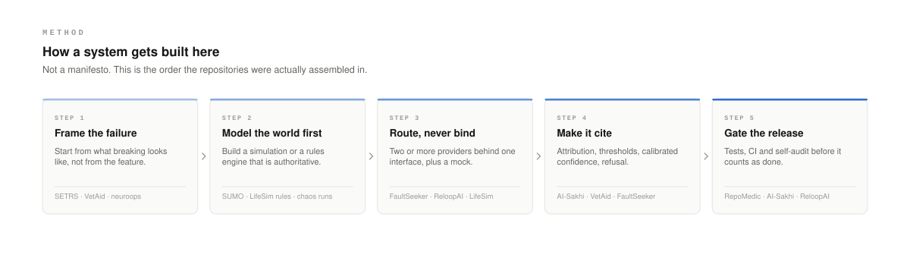
</picture>

<picture>
  <source media="(prefers-color-scheme: dark)" srcset="assets/divider-dark.svg">
  
</picture>

## Research log

<picture>
  <source media="(prefers-color-scheme: dark)" srcset="assets/timeline-dark.svg">
  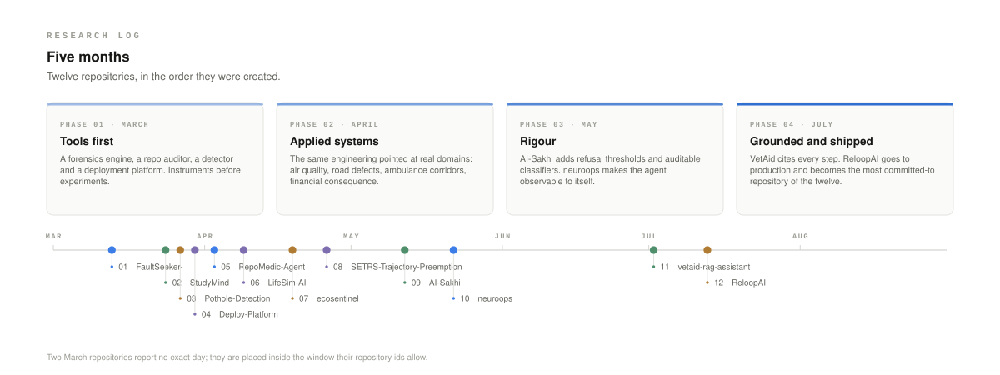
</picture>

<picture>
  <source media="(prefers-color-scheme: dark)" srcset="assets/divider-dark.svg">
  
</picture>

## Instruments

<picture>
  <source media="(prefers-color-scheme: dark)" srcset="assets/stack-dark.svg">
  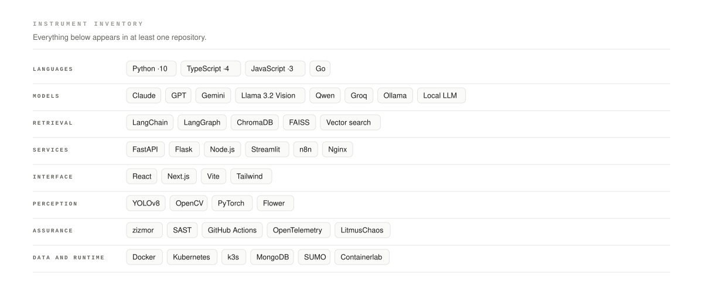
</picture>

<picture>
  <source media="(prefers-color-scheme: dark)" srcset="assets/divider-dark.svg">
  
</picture>

## The portfolio is one of the experiments

[**project-tayab.onrender.com**](https://project-tayab.onrender.com/) is not a page about the work. It is the argument itself, running.

Ask it a question and the retrieval happens in front of you: dense vectors and BM25 in parallel, reciprocal rank fusion to merge the two candidate lists, then a cross-encoder reranker on top. You can toggle any stage off and watch the ranking get worse, which is the only honest way to show that a stage earns its place. Answers stay sourced, the knowledge base is scored continuously, and there is a deterministic fallback underneath so a bad retrieval degrades instead of inventing.

Every conclusion on this page is implemented in it &mdash; grounding and citation from Division 02, weighted scoring from Division 03, the evaluation gate and refusal behaviour from Division 05. It is also the fastest way to understand how I build: type `help` into the shell on the page.

<sub>Hybrid dense and lexical retrieval &middot; Reciprocal rank fusion &middot; Cross-encoder reranking &middot; Continuous evaluation scoring &middot; Deterministic fallback &middot; In-browser retrieval trace</sub>

<picture>
  <source media="(prefers-color-scheme: dark)" srcset="assets/divider-dark.svg">
  
</picture>

## Where this goes

The next step is the one the log is already pointing at. The first eleven experiments taught me how to make a single system behave; what they have not yet taught me is how to prove it. `AI-Sakhi` has release gates, `neuroops` benchmarks itself against injected chaos, `FaultSeeker` reports a calibrated confidence, `RepoMedic` audits its own repository in CI. Four separate attempts at the same missing discipline: **evaluation**. Division 05 is what happened when I stopped treating it as a side effect: three repositories whose entire job is proving that a pipeline, a model or an agent did what it claimed.

So that is where I am going. AI engineering where the evaluation harness is built before the feature, where refusal is a designed behaviour rather than an edge case, and where a system that cannot show its evidence is not considered finished.

I am looking for AI or ML engineering work where that is the standard.

<div align="center">

[**Portfolio, live**](https://project-tayab.onrender.com/) &nbsp;&middot;&nbsp; [**All repositories**](https://github.com/Tayab-Ahamed?tab=repositories) &nbsp;&middot;&nbsp; [**ReLoop AI, live**](https://reloop-ai-liart.vercel.app)

&nbsp;&middot;&nbsp; [**LinkedIn**](https://www.linkedin.com/in/tayab-ahamed-822575308/)

</div>

<picture>
  <source media="(prefers-color-scheme: dark)" srcset="assets/divider-dark.svg">
  
</picture>

## Colophon

<details>
<summary><b>How this page is built</b></summary>

Every image on this page is an SVG generated by a Python script in [`scripts/`](scripts). Nothing is hand-drawn, nothing is stock, nothing was downloaded. The facts all live in one file, [`scripts/repos.py`](scripts/repos.py), which is where every count, date, division and pipeline on this page comes from &mdash; so the words and the pictures cannot disagree.

```
python3 scripts/build_assets.py   # regenerates every asset on this page
```

| | |
|---|---|
| **Assets** | 48 SVG files, light and dark pairs, roughly 3&ndash;20&nbsp;KB each |
| **Dependencies** | none &mdash; the standard library draws the SVG by hand |
| **Dark mode** | `<picture>` with `prefers-color-scheme`, honoured natively by GitHub |
| **Accessibility** | every SVG carries `<title>` and `<desc>`; every `` carries alt text; all body copy is real Markdown |
| **JavaScript** | none |

A word on honesty. This page shows no star counts, no follower counts and no streak graphics, because those numbers are currently zero and dressing them up would undermine everything else here. The counts that do appear &mdash; seventeen repositories, five divisions, six months, one live deployment &mdash; are all verifiable from the repository list; the portfolio site is counted separately because it is not one of the repositories. One repository, [`foundry`](https://github.com/Tayab-Ahamed/foundry), is a fork of the Ethereum toolchain and is deliberately excluded from the seventeen.

</details>
